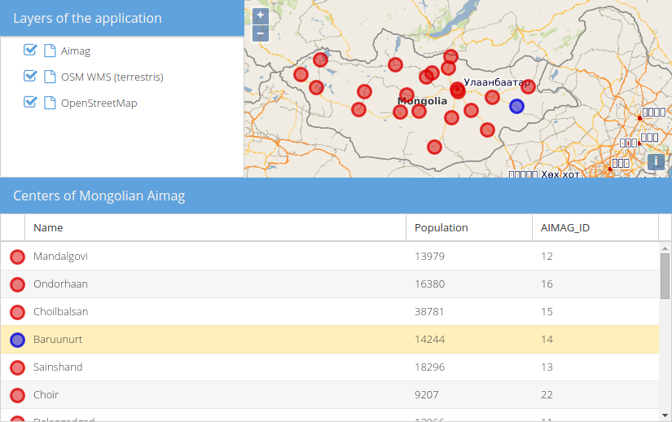

# Create a feature grid

Now it's time to change the grid to no longer show static data from [The Simpsons](https://en.wikipedia.org/wiki/The_Simpsons), but instead one row for every feature of the vector layer.

## Exercises

* Please set up `src/map.html` to contain the following lines:

```html
<!DOCTYPE html>
<html>
  <head>
    <meta charset="utf-8" />
    <title>Exercise | GeoExt Workshop</title>
    <link rel="stylesheet" href="https://cdnjs.cloudflare.com/ajax/libs/extjs/6.2.0/classic/theme-triton/resources/theme-triton-all.css" type="text/css" />
    <script src="https://cdnjs.cloudflare.com/ajax/libs/extjs/6.2.0/ext-all.js"></script>
    <link rel="stylesheet" href="./lib/ol/ol.css" type="text/css" />
    <script src="./lib/ol/ol.js"></script>
    <script src="https://geoext.github.io/geoext3/v3.0.0/GeoExt.js"></script>
  </head>
  <body>
    <script>
var map;
Ext.onReady(function(){
  var redStyle = new ol.style.Style({
    image: new ol.style.Circle({
      fill: new ol.style.Fill({
        color: 'rgba(220, 0, 0, 0.5)'
      }),
      stroke: new ol.style.Stroke({
        color: 'rgba(220, 0, 0, 0.8)',
        width: 3
      }),
      radius: 8
    })
  });
  var vectorLayer = new ol.layer.Vector({
    source: new ol.source.Vector({
      url: 'data/aimag-centers.json',
      format: new ol.format.GeoJSON()
    }),
    name: 'Aimag',
    style: redStyle
  });

  // 1) OpenLayers
  //
  // Create an instance of an OpenLayers map:
  map = new ol.Map({
    layers: [
      new ol.layer.Tile({
        source: new ol.source.OSM(),
        name: 'OpenStreetMap'
      }),
      new ol.layer.Tile({
        source: new ol.source.TileWMS({
          url: 'http://ows.terrestris.de/osm/service',
          params: {
            layers: 'OSM-WMS'
          }
        }),
        name: 'OSM WMS (terrestris)'
      }),
      vectorLayer
    ],
    view: new ol.View({
      center: ol.proj.fromLonLat( [106.92, 47.92] ),
      zoom: 4
    })
  });

  // 2) GeoExt
  //
  // Create an instance of the GeoExt map component with that map:
  var mapComponent = Ext.create('GeoExt.component.Map', {
    map: map,
    region: 'center'
  });

  var treeStore = Ext.create('GeoExt.data.store.LayersTree', {
    layerGroup: map.getLayerGroup()
  });

  var layerTreePanel = Ext.create('Ext.tree.Panel', {
    title: 'Layers of the application',
    width: 300,
    region: 'west',
    store: treeStore,
    rootVisible: false,
    viewConfig: {
      plugins: { ptype: 'treeviewdragdrop' }
    }
  });

  var featureStore = Ext.create('Ext.data.Store', {
    fields:[ 'name', 'email', 'phone'],
    data: [
      { name: 'Lisa', email: 'lisa@simpsons.com', phone: '555-111-1224' },
      { name: 'Bart', email: 'bart@simpsons.com', phone: '555-222-1234' },
      { name: 'Homer', email: 'homer@simpsons.com', phone: '555-222-1244' },
      { name: 'Marge', email: 'marge@simpsons.com', phone: '555-222-1254' }
    ]
  });

  var featurePanel = Ext.create('Ext.grid.Panel', {
    title: 'Simpsons',
    store: featureStore,
    columns: [
      { text: 'Name', dataIndex: 'name' },
      { text: 'Email', dataIndex: 'email', flex: 1 },
      { text: 'Phone', dataIndex: 'phone' }
    ],
    height: 200,
    region: 'south'
  });

  // 3) Ext JS
  //
  // Create a viewport
  var vp = Ext.create('Ext.container.Viewport', {
    layout: 'border',
    items: [
      mapComponent,
      layerTreePanel,
      featurePanel
    ]
  });
});
    </script>
  </body>
</html>
```

* Instead of a generic `Ext.data.Store`, use a `GeoExt.data.store.Features`. Look up the API documentation on https://geoext.github.io/geoext3/v3.0.0/docs for further details.

* Make sure you reference your vector layer and the map to work on when configuring the store.

```js
var featureStore = Ext.create('GeoExt.data.store.Features', {
  layer: vectorLayer,
  map: map
});
```

* Next we need to configure the `columns` of the `Ext.grid.Panel`. Look up the attributes of the GeoJSON and change the appropriate configuration in the config object for the `Ext.grid.Panel`.

```js
// E.g.
columns: [
  {text: 'Name', dataIndex: 'NAME', flex: 3},
  {text: 'Population', dataIndex: 'POP', flex: 1},
  {text: 'Id', dataIndex: 'AIMAG_ID', flex: 1}
]
```

* Additionally we can use the `Ext.grid.column.Widget ` class of ExtJS with an
`GeoExt.component.FeatureRenderer` to include the styling of the feature in the
grid. Add the following lines to your columns definition:

```js
{
  xtype: 'widgetcolumn',
  width: 40,
  widget: {
    xtype: 'gx_renderer'
  },
  onWidgetAttach: function(column, gxRenderer, rec) {
      gxRenderer.update({
        feature: rec.getFeature(),
        symbolizers: GeoExt.component.FeatureRenderer.determineStyle(rec)
      });
  }
}
```

* Note: If you sort on a column, some rendered features might disappear
from the grid. This is a known issue, and a solution to this is very welcome.

* When a row is selected in the grid, it is visually highlighted. Wouldn't it be nice if the feature on the map also has a different style once its associated row is selected?

* Assign a `selectionchange` listener on the grid and ensure that the correct feature is highlighted in the map. Hint: Create a new style and in the callback reset the style for every feature and reassign the new style to the to the currently selected feature. Use `console.log(arguments)` to see what you have been passed and how you can get the feature from the passed arguments.

* **Bonus:** Once the feature has a different style on the map, it would be nice if we could see that style in the grid, right? Change the `selectionchange` listener to also update the grid once the style of the feature has changed.

```js
var featurePanel = Ext.create('Ext.grid.Panel', {
  store: featureStore,
  region: 'south',
  title: 'Centers of Mongolian Aimag',
  columns: [
    {
      xtype: 'widgetcolumn',
      width: 40,
      widget: {
        xtype: 'gx_renderer'
      },
      onWidgetAttach: function(column, gxRenderer, rec) {
        gxRenderer.update({
          feature: rec.getFeature(),
          symbolizers: GeoExt.component.FeatureRenderer.determineStyle(rec)
        });
      }
    },
    {text: 'Name', dataIndex: 'NAME', flex: 3},
    {text: 'Population', dataIndex: 'POP', flex: 1},
    {text: 'AIMAG_ID', dataIndex: 'AIMAG_ID', flex: 1}
  ],
  listeners: {
    selectionchange: function(sm, selected) {
      // reset all selections
      featureStore.each(function(rec) {
        rec.getFeature().setStyle(null);
      });
      // highlight grid selection in map
      Ext.each(selected, function(rec) {
        rec.getFeature().setStyle(blueStyle);
      });
      // update the grid rendering of the geometry
      sm.view.refresh();
    }
  },
  height: 300
});
```

* Your application should now look similar to the image below:


