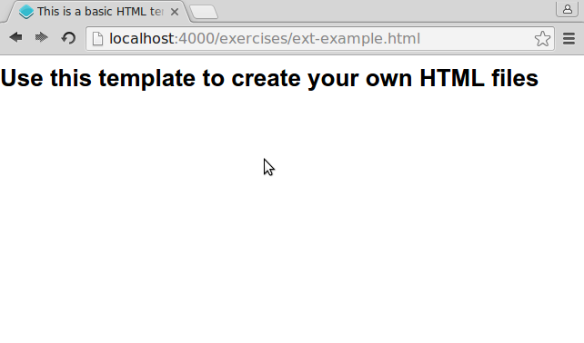

# Hello ExtJS

Before we can learn how to use GeoExt, we need to see if we can use ExtJS in our page.

We'll again need to include two resources in a HTML page to be able to use ExtJS: And again it is a CSS and a JavaScript file.

## Exercises

* Create a new `ext-example.html` from the basic template

[import](../snippets/template.html)

* Change `ex-example.html` to include the following two files:
  * https://cdnjs.cloudflare.com/ajax/libs/extjs/6.0.0/classic/theme-crisp/resources/theme-crisp-all.css
  * https://cdnjs.cloudflare.com/ajax/libs/extjs/6.0.0/ext-all.js

[import](../snippets/include-js-css.html)

* Verify that {{ book.exerciseUrl }}/ext-example.html loads your file.
* Does your basic page look like the one in the following image? Why does the font look so different?



* In rder to see if everything was included successfully, let's instatiate an ExtJS class. Please copy and paste the following into the `<body>` of the test-file:

```html
<script>
Ext.onReady(function(){
    var win = Ext.create('Ext.window.Window', {
        width: 200,
        height: 200,
        title: 'ExtJS …',
        html: '… is easy!'
    });
    win.show();
});
</script>
```

* You should see an `Ext.window.Window` like below:


