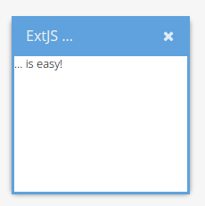

# Hello ExtJS

Before we can learn how to use GeoExt, we need to see if we can use ExtJS in our page.

Again we'll need to include two resources in a HTML page to be able to use ExtJS: And again it is a CSS and a JavaScript file.

## Exercises

* Create a new `ext-example.html` from the basic template

```html
<!DOCTYPE html>
<html>
  <head>
    <meta charset="utf-8" />
    <title>This is a basic HTML template</title>
  </head>
  <body>
    <h1>Use this template to create your own HTML files</h1>
  </body>
</html>
```

* Change `ext-example.html` to include the following two files:
  * https://cdnjs.cloudflare.com/ajax/libs/extjs/6.0.0/classic/theme-triton/resources/theme-triton-all.css
  * https://cdnjs.cloudflare.com/ajax/libs/extjs/6.0.0/ext-all.js

  ```html
  <!-- include a CSS stylesheet -->
  <link rel="stylesheet" href="path/to/file.css" type="text/css" />

  <!-- include an external JavaScript file -->
  <script src="path/to/file.js"></script>
  ```

* Verify that {{ book.exerciseUrl }}/ext-example.html loads your file.
* Does your basic page look like the one in the following image? Why does the font look so different?


* In order to see if everything was included successfully, let's instantiate an ExtJS class. Please copy and paste the following into the `<body>` of the test-file:

```html
<script>
Ext.onReady(function(){
    var win = Ext.create('Ext.window.Window', {
        width: 200,
        height: 200,
        title: 'ExtJS …',
        html: '… is easy!'
    });
    win.show();
});
</script>
```

* You should see an `Ext.window.Window` like below:


