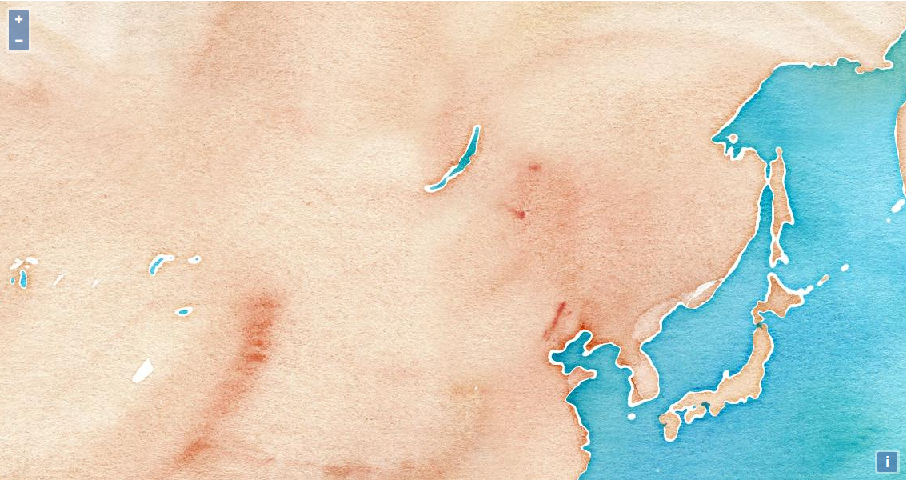
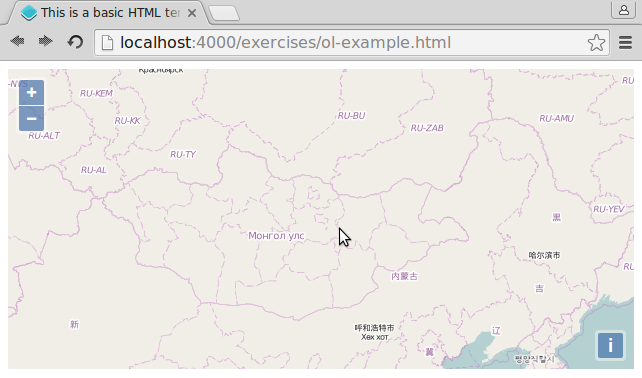

# Hello OpenLayers

Ok, we can create and edit HTML-files, and we can see the changes in our browser because all files in `src/exercises/` are always available under {{ book.exerciseUrl }}.

Let's see how we can include OpenLayers in our page so that we can start to use it. In order to do so, we need to include a CSS and a JavaScript file.

## Exercises

* See if you find a folder `lib/ol/` inside of the `src/exercises/`-folder. It should contain three files: `ol-debug.js`, `ol.js` and `ol.css`.
* Create a new `ol-example.html` from the basic template

```html
<!DOCTYPE html>
<html>
  <head>
    <meta charset="utf-8" />
    <title>This is a basic HTML template</title>
  </head>
  <body>
    <h1>Use this template to create your own HTML files</h1>
  </body>
</html>
```

* Change `ol-example.html` to include two files in the `<head>`. Use the below templates to include a CSS and a JavaScript file. The paths
  should be relative to the HTML page e.g. "./lib/ol/ol.css"

```html
<!-- include a CSS stylesheet -->
<link rel="stylesheet" href="path/to/file.css" type="text/css" />

<!-- include an external JavaScript file -->
<script src="path/to/file.js"></script>
```

* Verify that [{{ book.exerciseUrl }}/ol-example.html]({{ book.exerciseUrl }}/ol-example.html) loads your file.

* In the `<body>` of the file, add the following HTML-fragment, which includes a tiny piece of JavaScript:

```html
<div id="map" style="height: 600px"></div>
<script>
  var map = new ol.Map({
    target: 'map',
    layers: [
      new ol.layer.Tile({
        source: new ol.source.Stamen({layer: 'watercolor'})
      })
    ],
    view: new ol.View({
      center: ol.proj.fromLonLat([106.92, 47.92]),
      zoom: 4
    })
  });
</script>
```

* Now when you reload the [{{ book.exerciseUrl }}/ol-example.html]({{ book.exerciseUrl }}/ol-example.html) URL, you should see an OpenLayers map centered on Ulan Bator:



* To verify we are really looking at Ulan Bator, just change the layers to consist of an OpenStreetMap layer, which e.g. has labels and a country outline. Use the following JavaScript snippet at the appropriate place:

```js
new ol.layer.Tile({
  source: new ol.source.OSM()
})
```


