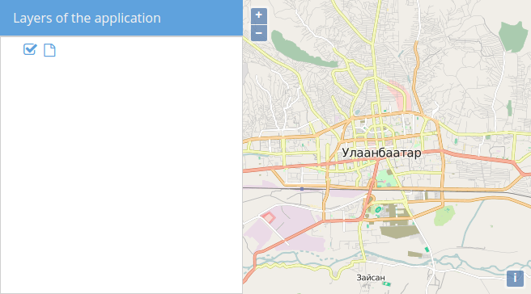

# Assign `LayersTree` store

Instead of the hard-coded hierarchical list of things in the tree, we now want to link the tree with our map.

In order to do this, we need to change the store that is used for the tree. Instead of the all-purpose `Ext.data.TreeStore`, we'll use the special GeoExt class `GeoExt.data.store.LayersTree`.


## Exercises

* If you haven't done already, set up a file called `map.html` in the `src/exercises` directory and paste the following contents:

```html
<!DOCTYPE html>
<html>
  <head>
    <meta charset="utf-8" />
    <title>Exercise | GeoExt Workshop</title>
    <link rel="stylesheet" href="https://cdnjs.cloudflare.com/ajax/libs/extjs/6.0.1/classic/theme-triton/resources/theme-triton-all.css" type="text/css" />
    <script src="https://cdnjs.cloudflare.com/ajax/libs/extjs/6.0.1/ext-all.js"></script>
    <link rel="stylesheet" href="./lib/ol/ol.css" type="text/css" />
    <script src="./lib/ol/ol.js"></script>
    <script src="https://geoext.github.io/geoext3/master/GeoExt.js"></script>
  </head>
  <body>
    <script>
var map;
Ext.onReady(function(){
  // 1) OpenLayers
  //
  // Create an instance of an OpenLayers map:
  map = new ol.Map({
    layers: [
      new ol.layer.Tile({
        source: new ol.source.OSM()
      })
    ],
    view: new ol.View({
      center: ol.proj.fromLonLat( [106.92, 47.92] ),
      zoom: 12
    })
  });

  // 2) GeoExt
  //
  // Create an instance of the GeoExt map component with that map:
  var mapComponent = Ext.create('GeoExt.component.Map', {
    map: map,
    region: 'center'
  });

  var store = Ext.create('Ext.data.TreeStore', {
    root: {
      expanded: true,
      children: [
        { text: 'detention', leaf: true },
        { text: 'homework', expanded: true, children: [
          { text: 'book report', leaf: true },
          { text: 'algebra', leaf: true}
        ] },
        { text: 'buy lottery tickets', leaf: true }
      ]
    }
  });

  var layerTreePanel = Ext.create('Ext.tree.Panel', {
    title: 'Layers of the application',
    width: 300,
    region: 'west',
    store: store,
    rootVisible: false
  });

  // 3) Ext JS
  //
  // Create a viewport
  var vp = Ext.create('Ext.container.Viewport', {
    layout: 'border',
    items: [
      mapComponent,
      layerTreePanel
    ]
  });
});
    </script>
  </body>
</html>
```

* Make yourself familiar with the `GeoExt.data.store.LayersTree` class by studying the following API-docs: http://geoext.github.io/geoext3/master/docs/#!/api/GeoExt.data.store.LayersTree

* Create an instance of the `GeoExt.data.store.LayersTree` class and pass it the following configuration object:

```js
{
  layerGroup: /* the top level layer group of the map */
}
```

* Study the API docs of `ol.Map` to get the appropriate `LayerGroup`: http://openlayers.org/en/v3.17.1/apidoc/ol.Map.html

* If everything works fine, you should see a tree with one (currently unlabeled) leaf. Next to the leaf you find a checkbox, that reflects the overall visibility of the layer.



* Study the `GeoExt.data.store.LayersTree` and find out why there is no label next to the tree-element.

* Add more layers to the map and see if they all appear in the map and in the tree. Take e.g. the following WMS:

```
url: http://ows.terrestris.de/osm/service
layers: OSM-WMS
```

* Read the documentation for the Ext class [`Ext.tree.plugin.TreeViewDragDrop`](http://docs.sencha.com/extjs/6.0/6.0.0-classic/#!/api/Ext.tree.plugin.TreeViewDragDrop). What happens if you add this plugin to the tree?

* Your application should now e.g. look like this:


* For reference, here are code-snippets for the relevant parts of the code:

```js
// layers should have a property for their name (configurable)
new ol.layer.Tile({
  source: new ol.source.OSM(),
  name: 'OpenStreetMap'
});

// Creating an appropriate treestore
var treeStore = Ext.create('GeoExt.data.store.LayersTree', {
  layerGroup: map.getLayerGroup()
});

// Use the store in the tree and also load plugin
var layerTreePanel = Ext.create('Ext.tree.Panel', {
  title: 'Layers of the application',
  width: 300,
  region: 'west',
  store: treeStore,
  rootVisible: false,
  viewConfig: {
    plugins: { ptype: 'treeviewdragdrop' }
  }
});
```
