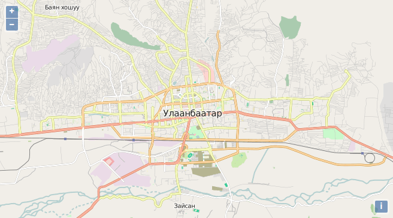

# Basic example

We want to have a look at a fully working example first.

## Exercises

* Create a new file `map.html` in the `src/exercise`-directory.
* Paste the following html-code into the file you have just created:
```html
<!DOCTYPE html>
<html>
    <head>
        <meta charset="utf-8">
        <title>Exercise | GeoExt Workshop</title>
        <link rel="stylesheet" href="https://cdnjs.cloudflare.com/ajax/libs/extjs/6.0.0/classic/theme-triton/resources/theme-triton-all.css" type="text/css">
        <script src="https://cdnjs.cloudflare.com/ajax/libs/extjs/6.0.0/ext-all.js" type="text/javascript"></script>
        <link rel="stylesheet" href="./lib/ol/ol.css" type="text/css">
        <script src="./lib/ol/ol.js" type="text/javascript"></script>
        <script src="https://geoext.github.io/geoext3/master/GeoExt.js" type="text/javascript"></script>
    </head>
    <body>
        <script>
var map;
Ext.onReady(function(){
    // 1) OpenLayers
    //
    // Create an instance of an OpenLayers map:
    map = new ol.Map({
        layers: [
            new ol.layer.Tile({
                source: new ol.source.OSM()
            })
        ],
        view: new ol.View({
            center: ol.proj.fromLonLat( [106.92, 47.92] ),
            zoom: 12
        })
    });

    // 2) GeoExt
    //
    // Create an instance of the GeoExt map component with that map:
    var mapComponent = Ext.create('GeoExt.component.Map', {
        map: map
    });

    // 3) Ext JS
    //
    // Create a viewport
    var vp = Ext.create('Ext.container.Viewport', {
        layout: 'fit',
        items: mapComponent
    });
});
        </script>
    </body>
</html>
```

* Verify that {{ book.exerciseUrl }}/map.html loads in your browser and looks like the picture below.



We will now [dissect the example](dissecting-example.md) and explain what each part does.
