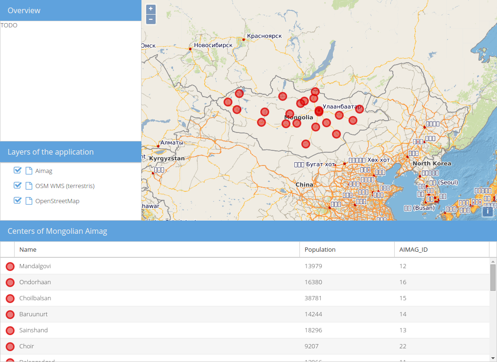
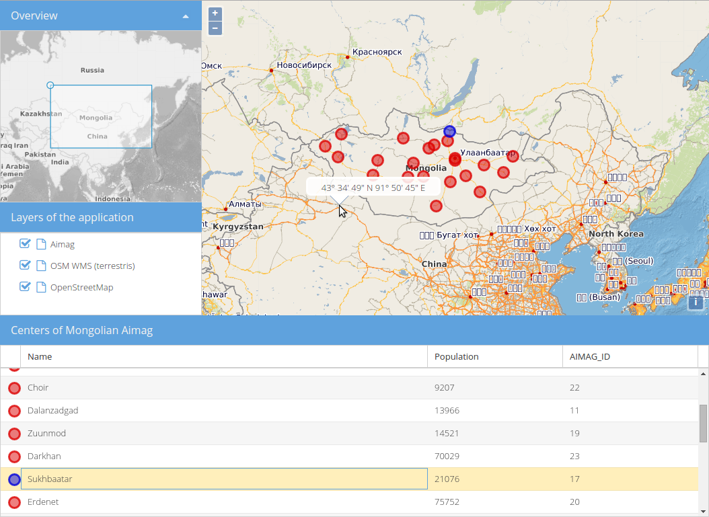

# Overview map

Especially when zoomed in, it can be hard to understand the extent of the mappanel. Overview-maps, which show the extent of the main map on a smaller scale can be very useful then. GeoExt comes with a useful component to create overviews: `GeoExt.component.OverviewMap`.

## Exercises

* We'll start again with the code of `map.html` from the previous sections. It's already some lines long:

```html
<!DOCTYPE html>
<html>
  <head>
    <meta charset="utf-8" />
    <title>Exercise | GeoExt Workshop</title>
    <link rel="stylesheet" href="https://cdnjs.cloudflare.com/ajax/libs/extjs/6.0.0/classic/theme-triton/resources/theme-triton-all.css" type="text/css" />
    <script src="https://cdnjs.cloudflare.com/ajax/libs/extjs/6.0.0/ext-all.js"></script>
    <link rel="stylesheet" href="./lib/ol/ol.css" type="text/css" />
    <link rel="stylesheet" href="http://geoext.github.io/geoext3/master/resources/css/gx-popup.css" type="text/css" />
    <script src="./lib/ol/ol.js"></script>
    <script src="https://geoext.github.io/geoext3/master/GeoExt.js"></script>
    <style>
.gx-popup p {
  padding: 5px 5px 0 5px;
  border-radius: 7px;
  background-color: rgba(255,255,255,0.85);
  border: 3px solid white;
  margin: 0;
  text-align: center;
}
    </style>
  </head>
  <body>
    <script>
var map;
Ext.onReady(function(){

  var redStyle = new ol.style.Style({
    image: new ol.style.Circle({
      fill: new ol.style.Fill({
        color: 'rgba(220, 0, 0, 0.5)'
      }),
      stroke: new ol.style.Stroke({
        color: 'rgba(220, 0, 0, 0.8)',
        width: 3
      }),
      radius: 8
    })
  });
  var blueStyle = new ol.style.Style({
    image: new ol.style.Circle({
      fill: new ol.style.Fill({
        color: 'rgba(0, 0, 220, 0.5)'
      }),
      stroke: new ol.style.Stroke({
        color: 'rgba(0, 0, 220, 0.8)',
        width: 3
      }),
      radius: 8
    })
  });

  var vectorLayer = new ol.layer.Vector({
    source: new ol.source.Vector({
      url: 'data/aimag-centers.json',
      format: new ol.format.GeoJSON()
    }),
    name: 'Aimag',
    style: redStyle
  });

  // 1) OpenLayers
  //
  // Create an instance of an OpenLayers map:
  map = new ol.Map({
    layers: [
      new ol.layer.Tile({
        source: new ol.source.OSM(),
        name: 'OpenStreetMap'
      }),
      new ol.layer.Tile({
        source: new ol.source.TileWMS({
          url: 'http://ows.terrestris.de/osm/service',
          params: {
            layers: 'OSM-WMS'
          }
        }),
        name: 'OSM WMS (terrestris)'
      }),
      vectorLayer
    ],
    view: new ol.View({
      center: ol.proj.fromLonLat( [106.92, 47.92] ),
      zoom: 4
    })
  });

  // 2) GeoExt
  //
  // Create an instance of the GeoExt map component with that map:
  var mapComponent = Ext.create('GeoExt.component.Map', {
    map: map,
    region: 'center',
    pointerRest: true,
    pointerRestInterval: 750,
    pointerRestPixelTolerance: 5
  });

  var popup = Ext.create('GeoExt.component.Popup', {
    map: map,
    width: 200
  });

  // Add a pointerrest handler to the map component to render the popup.
  mapComponent.on('pointerrest', function(evt) {
    var coordinate = evt.coordinate;
    var lonlat = ol.proj.transform(coordinate, 'EPSG:3857', 'EPSG:4326')
    var hdms = ol.coordinate.toStringHDMS(lonlat);
    popup.setHtml('<p>' + hdms + '</p>');
    popup.position(coordinate);
    popup.show();
  });

  // hide the popup once it isn't on the map any longer
  mapComponent.on('pointerrestout', popup.hide, popup);

  var treeStore = Ext.create('GeoExt.data.store.LayersTree', {
    layerGroup: map.getLayerGroup()
  });

  var layerTreePanel = Ext.create('Ext.tree.Panel', {
    title: 'Layers of the application',
    width: 300,
    region: 'west',
    store: treeStore,
    rootVisible: false,
    viewConfig: {
      plugins: { ptype: 'treeviewdragdrop' }
    }
  });

  var featureStore = Ext.create('GeoExt.data.store.Features', {
    layer: vectorLayer,
    map: map
  });
  var featureGrid = Ext.create('Ext.grid.Panel', {
    store: featureStore,
    region: 'south',
    title: 'Centers of Mongolian Aimag',
    columns: [
      {xtype: 'gx_symbolizercolumn', width: 30},
      {text: 'Name', dataIndex: 'NAME', flex: 3},
      {text: 'Population', dataIndex: 'POP', flex: 1},
      {text: 'AIMAG_ID', dataIndex: 'AIMAG_ID', flex: 1}
    ],
    listeners: {
      selectionchange: function(sm, selected) {
        // reset all selections
        featureStore.each(function(rec) {
          rec.getFeature().setStyle(null);
        });
        // highlight grid selection in map
        Ext.each(selected, function(rec) {
          rec.getFeature().setStyle(blueStyle);
        });
        // update the grid rendering of the geometry
        sm.view.refresh();
      }
    },
    height: 300
  });

  // 3) Ext JS
  //
  // Create a viewport
  var vp = Ext.create('Ext.container.Viewport', {
    layout: 'border',
    items: [
      mapComponent,
      layerTreePanel,
      featureGrid
    ]
  });
});
    </script>
  </body>
</html>
```

* If you open this file in a browser ({{ book.exerciseUrl }}/map.html), the application should look like in the following image, but you should also be able to see popups when hovering over a map location:


* We want the overview map to live in the top-left corner of our application, right above the layer tree. For this we will &mdash; as usual &mdash; first prepare the layout before we use the GeoExt component.

* Create a new panel that we will eventually replace with the overview, but don't add it anywhere yet:

```js
var overviewPanel = Ext.create('Ext.panel.Panel', {
  title: 'Overview',
  layout: 'fit',
  html: 'TODO',
  height: 300,
  width: 300
});
```

* Instead of assigning the <code>region: &#39;west&#39;</code> to the layer tree panel, we'll create a new `container` with the `vbox`-layout and pass that to the `items` of the `Ext.container.Viewport`:

```js
var vp = Ext.create('Ext.container.Viewport', {
  layout: 'border',
  items: [
    mapComponent,
    // below is the new wrapping container:
    {
      xtype: 'container',
      region: 'west',
      layout: 'vbox',
      collapsible: true,
      items: [
        overviewPanel,
        layerTreePanel
      ]
    },
    featureGrid
  ]
});
```

* If we specify `flex: 1` for the `layerTreePanel` (the `region`-property is no longer needed), your application should look like this:



* Now it is time to use `GeoExt.component.OverviewMap`: Create an instance of this class and read the [related API-docs](http://geoext.github.io/geoext3/master/docs/#!/api/GeoExt.component.OverviewMap).

* Configure the `overviewPanel` with the created overview instead of <code>html: &#39;TODO&#39;</code> (via `items`).

* You may want to have another layer in the overview. How about this WMS?

```
URL: http://ows.terrestris.de/osm-gray/service
Layers: OSM-WMS
```

```js
var overview = Ext.create('GeoExt.component.OverviewMap', {
  parentMap: map,
  layers: [
    new ol.layer.Tile({
      source: new ol.source.TileWMS({
        url: 'http://ows.terrestris.de/osm-gray/service',
        params: {
          layers: 'OSM-WMS'
        }
      }),
      opacity: 0.8
    })
  ]
});
var overviewPanel = Ext.create('Ext.panel.Panel', {
  title: 'Overview',
  layout: 'fit',
  items: overview,
  height: 300,
  width: 300,
  collapsible: true
});
```

* If everything went well, you should see an application like below:


