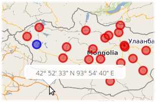

# Popups

In this chapter we want to add short informative popups on the map. We will open the popup when the mouse lasts for a certain amount of time at a specific location. Inside the popup we show the formatted coordinates of the hover-location. To do this we will make use of a GeoExt event on the `GeoExt.component.Map` and of the class `GeoExt.component.Popup`.

## Exercises

* Prepare the `map.html` file to contain the following code. This is basically the result of the previous chapters:

```html
<!DOCTYPE html>
<html>
  <head>
    <meta charset="utf-8" />
    <title>Exercise | GeoExt Workshop</title>
    <link rel="stylesheet" href="https://cdnjs.cloudflare.com/ajax/libs/extjs/6.0.1/classic/theme-triton/resources/theme-triton-all.css" type="text/css" />
    <script src="https://cdnjs.cloudflare.com/ajax/libs/extjs/6.0.1/ext-all.js"></script>
    <link rel="stylesheet" href="./lib/ol/ol.css" type="text/css" />
    <script src="./lib/ol/ol.js"></script>
    <script src="https://geoext.github.io/geoext3/master/GeoExt.js"></script>
  </head>
  <body>
    <script>
var map;
Ext.onReady(function(){

  var redStyle = new ol.style.Style({
    image: new ol.style.Circle({
      fill: new ol.style.Fill({
        color: 'rgba(220, 0, 0, 0.5)'
      }),
      stroke: new ol.style.Stroke({
        color: 'rgba(220, 0, 0, 0.8)',
        width: 3
      }),
      radius: 8
    })
  });
  var blueStyle = new ol.style.Style({
    image: new ol.style.Circle({
      fill: new ol.style.Fill({
        color: 'rgba(0, 0, 220, 0.5)'
      }),
      stroke: new ol.style.Stroke({
        color: 'rgba(0, 0, 220, 0.8)',
        width: 3
      }),
      radius: 8
    })
  });

  var vectorLayer = new ol.layer.Vector({
    source: new ol.source.Vector({
      url: 'data/aimag-centers.json',
      format: new ol.format.GeoJSON()
    }),
    name: 'Aimag',
    style: redStyle
  });

  // 1) OpenLayers
  //
  // Create an instance of an OpenLayers map:
  map = new ol.Map({
    layers: [
      new ol.layer.Tile({
        source: new ol.source.OSM(),
        name: 'OpenStreetMap'
      }),
      new ol.layer.Tile({
        source: new ol.source.TileWMS({
          url: 'http://ows.terrestris.de/osm/service',
          params: {
            layers: 'OSM-WMS'
          }
        }),
        name: 'OSM WMS (terrestris)'
      }),
      vectorLayer
    ],
    view: new ol.View({
      center: ol.proj.fromLonLat( [106.92, 47.92] ),
      zoom: 4
    })
  });

  // 2) GeoExt
  //
  // Create an instance of the GeoExt map component with that map:
  var mapComponent = Ext.create('GeoExt.component.Map', {
    map: map,
    region: 'center'
  });

  var treeStore = Ext.create('GeoExt.data.store.LayersTree', {
    layerGroup: map.getLayerGroup()
  });

  var layerTreePanel = Ext.create('Ext.tree.Panel', {
    title: 'Layers of the application',
    width: 300,
    region: 'west',
    store: treeStore,
    rootVisible: false,
    viewConfig: {
      plugins: { ptype: 'treeviewdragdrop' }
    }
  });

  var featureStore = Ext.create('GeoExt.data.store.Features', {
    layer: vectorLayer,
    map: map
  });
  var featureGrid = Ext.create('Ext.grid.Panel', {
    store: featureStore,
    region: 'south',
    title: 'Centers of Mongolian Aimag',
    columns: [
      {xtype: 'gx_symbolizercolumn', width: 30},
      {text: 'Name', dataIndex: 'NAME', flex: 3},
      {text: 'Population', dataIndex: 'POP', flex: 1},
      {text: 'AIMAG_ID', dataIndex: 'AIMAG_ID', flex: 1}
    ],
    listeners: {
      selectionchange: function(sm, selected) {
        // reset all selections
        featureStore.each(function(rec) {
          rec.getFeature().setStyle(null);
        });
        // highlight grid selection in map
        Ext.each(selected, function(rec) {
          rec.getFeature().setStyle(blueStyle);
        });
        // update the grid rendering of the geometry
        sm.view.refresh();
      }
    },
    height: 300
  });

  // 3) Ext JS
  //
  // Create a viewport
  var vp = Ext.create('Ext.container.Viewport', {
    layout: 'border',
    items: [
      mapComponent,
      layerTreePanel,
      featureGrid
    ]
  });
});
    </script>
  </body>
</html>
```

* If you open this file in a browser ({{ book.exerciseUrl }}/map.html), the application should look like in the following image:


* For popups to look right, we need some CSS. Include the following in the `<head>` of the page:

```html
<link rel="stylesheet" href="http://geoext.github.io/geoext3/master/resources/css/gx-popup.css" type="text/css" />
<style>
.gx-popup p {
  padding: 5px 5px 0 5px;
  border-radius: 7px;
  background-color: rgba(255,255,255,0.85);
  border: 3px solid white;
  margin: 0;
  text-align: center;
}
</style>
```

* Configure the existing `GeoExt.component.Map` with `pointerRest: true`. Only if this configuration is `true`, the map-component will emit the `pointerrest` & `pointerrestout` events.

* Read the documentation for [`pointerrest`](http://geoext.github.io/geoext3/master/docs/#!/api/GeoExt.component.Map-event-pointerrest) & [`pointerrestout`](http://geoext.github.io/geoext3/master/docs/#!/api/GeoExt.component.Map-event-pointerrestout)

* Register an event-listener on `pointerrest` that logs the hovered coordinate. Use the OpenLayers utility methods `ol.coordinate.toStringHDMS` and `ol.proj.transform` on the `evt.coordinate` to format the coordinate.

```js
var mapComponent = Ext.create('GeoExt.component.Map', {
  map: map,
  region: 'center',
  pointerRest: true
});
mapComponent.on('pointerrest', function(evt) {
  var coordinate = evt.coordinate;
  var lonlat = ol.proj.transform(coordinate, 'EPSG:3857', 'EPSG:4326')
  var hdms = ol.coordinate.toStringHDMS(lonlat);
  console.log(hdms);
});
```

* Once you have the above logging of the coordinate in place, we can now create a popup.

* Instantiate the class [`GeoExt.component.Popup`](http://geoext.github.io/geoext3/master/docs/#!/api/GeoExt.component.Popup) and configure it with your map. You should also provide a `width`. Store the popup in an accessible variable; `var popup` is a good choice.

* Inside of the configured callback on `pointerrest` we now want to update the HTML of the popup (method `setHtml`) and reposition it at the coordinate (method `position`, pass the coordinates in the view projection). Finally, `show` the popup.

```js
mapComponent.on('pointerrest', function(evt) {
  var coordinate = evt.coordinate;
  var lonlat = ol.proj.transform(coordinate, 'EPSG:3857', 'EPSG:4326')
  var hdms = ol.coordinate.toStringHDMS(lonlat);
  popup.setHtml('<p>' + hdms + '</p>');
  popup.position(coordinate);
  popup.show();
});
```

* You may notice that the popup stays in place if the mouse leaves the map viewport, which is undesired in most of the cases. Use the event `pointerrestout` to `hide` the popup whenever the mouse leaves the map.

```js
mapComponent.on('pointerrestout', popup.hide, popup);
```

* Congratulations, you can now happily hover anywhere on the map and be greeted with the hovered coordinate:


